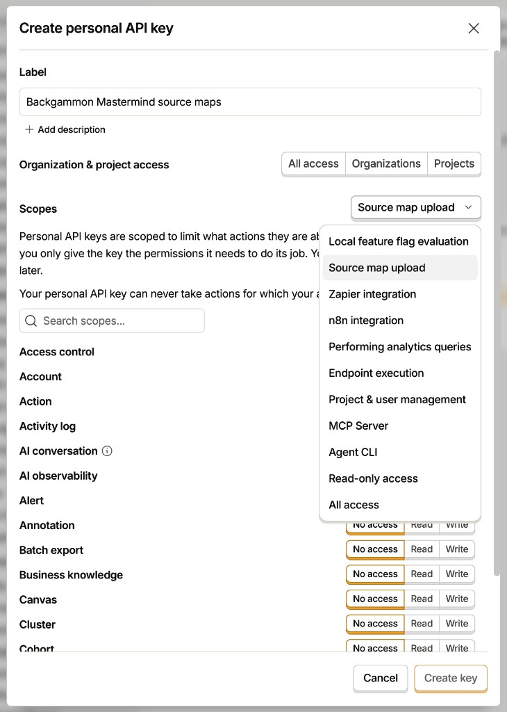

# PostHog (template setup)

Canonical analytics + error tracking + session replay for this Expo / React Native template fork.

| Resource | Link |
|----------|------|
| This project | [Backgammon Mastermind](https://us.posthog.com/project/507969) |
| Ingest host | `https://us.i.posthog.com` |
| RN error tracking install | [posthog.com/docs/error-tracking/installation/react-native](https://posthog.com/docs/error-tracking/installation/react-native) |
| Source maps / native symbols | [posthog.com/docs/error-tracking/upload-source-maps/react-native](https://posthog.com/docs/error-tracking/upload-source-maps/react-native) |
| Session replay (RN) | [posthog.com/docs/session-replay/installation/react-native](https://posthog.com/docs/session-replay/installation/react-native) |
| Expo + PostHog guide | [docs.expo.dev/guides/using-posthog](https://docs.expo.dev/guides/using-posthog/) |
| Expo PostHog EAS recipes | [docs.expo.dev/guides/using-posthog/recipes](https://docs.expo.dev/guides/using-posthog/recipes/) |
| `eas integrations:posthog:connect` | Same Expo guide — provisions project + env vars |

## What you get

| Capability | Where | Notes |
|------------|--------|--------|
| Product analytics | `posthog.capture` / lifecycle / touch autocapture | Already used across game + learn + settings |
| Screen views | `posthog.screen` in `src/app/_layout.tsx` | Manual (Expo Router) — autocapture screens off |
| Feature flags | SDK `preloadFeatureFlags` | Evaluate with `posthog.getFeatureFlag` |
| Error tracking | `errorTracking.autocapture` + `PostHogErrorBoundary` | JS + native crashes (native needs plugin + symbols) |
| Source maps | Metro `getPostHogExpoConfig` + Expo plugin | Readable JS stacks |
| Native symbols | `uploadNativeSymbols: true` on EAS Build | dSYM / ProGuard when `POSTHOG_CLI_*` is set |
| Session replay | `enableSessionReplay` (iOS/Android only) | Needs **Record user sessions** in project settings; not Expo Go |
| Surveys / heatmaps | Project toggles | Surveys via SDK; heatmaps mainly web |

## Environments: which keys differ?

PostHog does **not** use EAS “production / preview / development” by itself. Differentiation is entirely which **project token** (`phc_…`) the app sends, plus optional event properties.

Official guide: [Multiple environments](https://posthog.com/tutorials/multiple-environments) · [Projects](https://posthog.com/docs/settings/projects)

### Two different kinds of keys

| Key | Prefix | What it is | Per EAS env? |
|-----|--------|------------|--------------|
| **Project token** | `phc_…` | Client SDK token. Events/replays/errors land in **that PostHog project**. | **Yes, if you want separate projects** (recommended at scale). Same token = same bucket. |
| **Personal API key** | `phx_…` | *Your* upload credential for CLI / source maps / native symbols. Not sent by the app. | **No.** One key for the org (or scoped to projects) is correct across all EAS envs. |

So: sharing `POSTHOG_CLI_API_KEY` on production + preview + development is **intentional**. That key only authenticates uploads; `POSTHOG_CLI_PROJECT_ID` decides *which project* receives the maps.

### How PostHog “knows” the environment

1. **Best practice (PostHog):** separate **projects** — e.g. `Backgammon Mastermind`, `… Preview`, `… Development` — each with its own `phc_…`. Put a different `POSTHOG_PROJECT_TOKEN` (and matching `POSTHOG_CLI_PROJECT_ID`) in each EAS environment. Feature flags can be [copied across projects](https://posthog.com/tutorials/multiple-environments#feature-flags-with-multiple-projects).
2. **This repo’s default (solo / early product):** **one project**, one `phc_…` in all EAS profiles. The SDK registers super property `app_env` = `EXPO_PUBLIC_APP_ENV` (`development` \| `preview` \| `production`) so insights can filter. Also register `platform`.
3. **Alternatives:** disable capture in `__DEV__` / local; or capture everything and use PostHog’s “filter internal and test users” on insights ([tutorial](https://posthog.com/tutorials/multiple-environments#filtering-internal-and-test-users)).

### What we ship today

| EAS env | `POSTHOG_PROJECT_TOKEN` (`phc_`) | `POSTHOG_CLI_API_KEY` (`phx_`) | `POSTHOG_CLI_PROJECT_ID` |
|---------|----------------------------------|-------------------------------|---------------------------|
| production | shared Backgammon Mastermind project | **same** personal key | `507969` |
| preview | same | same | same |
| development | same | same | same |

Events are tagged with `app_env` for filtering. When you’re ready to split:

```bash
# Example: production stays 507969; create a new PostHog project for preview and:
eas env:create --name POSTHOG_PROJECT_TOKEN --value phc_preview… --visibility plaintext --environment preview --force --non-interactive
eas env:create --name POSTHOG_CLI_PROJECT_ID --value <preview_numeric_id> --visibility plaintext --environment preview --force --non-interactive
# CLI personal key can stay the same if it has access to both projects
```

Also update `eas.json` `env` blocks (or rely solely on EAS Environment Variables and remove duplicated tokens from `eas.json`).

### Source maps across envs

Upload maps to the **same project** that will receive the crash (`POSTHOG_CLI_PROJECT_ID` must match the `phc_` project). Wrong project ID = unsymbolicated stacks even though upload “succeeded.”

## Env vars

### App (public / build-time)

| Var | Purpose |
|-----|---------|
| `POSTHOG_PROJECT_TOKEN` | Project API key (`phc_…`) → `extra.posthogProjectToken` |
| `POSTHOG_HOST` | Default `https://us.i.posthog.com` |

Set in `.env` locally and in `eas.json` `env` (or EAS Environment Variables) for preview/production.

### Source map / symbol upload (secret)

| Var | Purpose |
|-----|---------|
| `POSTHOG_CLI_API_KEY` | Personal API key (`phx_…`) — **Sensitive** in EAS; GitHub Actions secret for PR uploads |
| `POSTHOG_CLI_PROJECT_ID` | Numeric project id (`507969`) |
| `POSTHOG_CLI_HOST` | `https://us.posthog.com` (US Cloud **UI** host, not `i.posthog.com`) |

## CLI key walkthrough (one human step)

PostHog does **not** let agents mint personal API keys. Create once → script wires EAS + GitHub + `.env`.

### 1. Create the key in the UI

Open **[Personal API keys](https://us.posthog.com/settings/user-api-keys)** → **Create personal API key**.



| Field | Value |
|-------|--------|
| Label | `<App name> source maps` (e.g. `Backgammon Mastermind source maps`) |
| Organization & project access | Default **All access** is fine for a single-dev org; tighten later if needed |
| Scopes preset | **Source map upload** |

After picking the preset, **scroll the resource list** and bump these if you want [Expo PostHog workflow recipes](https://docs.expo.dev/guides/using-posthog/recipes/) (flags / annotations / queries):

| Resource | Suggested |
|----------|-----------|
| `feature_flag` | Read + Write |
| `query` | Read |
| `annotation` | Write (or Read + Write) |

Then **Create key** and copy the `phx_…` value once (it won’t be shown again).

### 2. Wire secrets (3 EAS calls, not 9)

```bash
./scripts/posthog-set-cli-secrets.sh
# or non-interactive:
./scripts/posthog-set-cli-secrets.sh 'phx_…'
```

The script attaches each variable to **production + preview + development in one `eas env:create`** (so you don’t sit through a slow per-env loop). It also sets the GitHub Actions secret and gitignored `.env` lines.

If you Ctrl-C mid-run after EAS already has the key:

```bash
./scripts/posthog-set-cli-secrets.sh --from-eas
```

### 3. Verify

```bash
eas env:list --environment production   # expect POSTHOG_CLI_API_KEY=***** + PROJECT_ID + HOST
gh secret list | grep POSTHOG           # expect POSTHOG_CLI_API_KEY
```

## Code layout

- Client: `src/config/posthog.ts`
- Provider + boundary: `src/app/_layout.tsx`
- Crash UI: `src/components/posthog-error-fallback.tsx`
- Metro debug IDs: `metro.config.js` → `getPostHogExpoConfig` + Uniwind
- Native upload hooks: `posthog-react-native/expo` in `app.config.ts`
- Native plugin package: `@posthog/react-native-plugin` (session replay + native crashes)
- Secrets script: `scripts/posthog-set-cli-secrets.sh`
- Optional OTA + maps workflow: `.eas/workflows/update-with-posthog.yml`

## CI / OTA source maps

**EAS Build** uploads JS maps + native symbols automatically via the Expo config plugin when `POSTHOG_CLI_*` is present on that build’s environment.

**EAS Update** does not run that plugin path. After publishing an update that leaves `dist/`:

```bash
# One native platform per export — Hermes upload rejects a full multi-platform/web tree
npx eas-cli update --branch preview --platform ios --auto --non-interactive
pnpm posthog:upload-sourcemaps
```

PR preview (`.github/workflows/preview.yml`) uploads from `dist` when the GitHub secret exists.

**Web** (`expo export --platform web --source-maps`): upload with `pnpm posthog:upload-sourcemaps:web` (see [RN source maps](https://posthog.com/docs/error-tracking/upload-source-maps/react-native)).

## Project settings checklist

In PostHog project settings (already enabled for Backgammon Mastermind):

- [x] Enable exception autocapture
- [x] Record user sessions
- [x] Capture console logs / performance (replay + web)
- [x] Surveys + heatmaps opted in
- [x] `POSTHOG_CLI_*` on EAS production / preview / development
- [x] GitHub Actions `POSTHOG_CLI_API_KEY`

## Verify product data

1. Launch a **development build** (not Expo Go) with a real `POSTHOG_PROJECT_TOKEN`.
2. Trigger a test: `posthog.captureException(new Error('posthog_setup_probe'))` once, or throw inside a screen.
3. Confirm events in [Activity](https://us.posthog.com/project/507969/activity/explore) and exceptions under **Error tracking**.
4. Interact ~10s on device → **Session replay**.
5. After a production/preview EAS build with CLI env set → **Error tracking → Symbol sets**.

## Privacy / legal

Keep privacy + terms + store nutrition labels aligned (PR template + release checklist have a legal gate). Current policy allows analytics, crashes, native session replay (may include on-screen gameplay), and optional future anonymous gameplay diagnostics. See `docs/privacy-policy.md`.

## New app from this template (agent-friendly)

Goal: clone → rename → PostHog project → ship. Minimize human steps.

1. **Scaffold** from the Obytes fork / this repo; fill `app.config.ts` owner/slug/`EAS_PROJECT_ID`, `env.ts` names/schemes (see [obytes-template-playbook](./obytes-template-playbook.md)).
2. **PostHog project** in the right org → copy `phc_…` into `eas.json` / `.env` as `POSTHOG_PROJECT_TOKEN`.
3. **Project toggles** (agent via MCP when possible): exception autocapture, session recording, surveys/heatmaps as needed.
4. **One human click**: personal API key (screenshot above) → `./scripts/posthog-set-cli-secrets.sh` with `POSTHOG_CLI_PROJECT_ID=<new id>`.
5. **Optional Expo shortcut**: [`eas integrations:posthog:connect`](https://docs.expo.dev/guides/using-posthog/) (`--region US|EU`, `--error-tracking`, `--session-replay`) if starting from a bare Expo app.
6. Keep Metro + Expo plugin + `src/config/posthog.ts` as the standard skeleton — don’t re-invent per app.
7. **Legal gate** on every PR/release if permissions or data practices change.

Human-only forever: minting `phx_…` personal keys (PostHog security model). Everything else should be scripted or MCP-driven.
