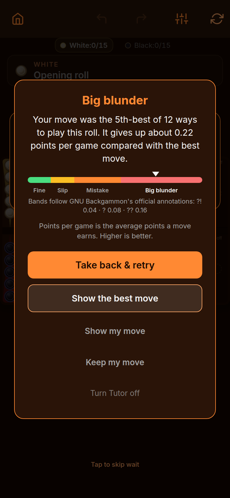
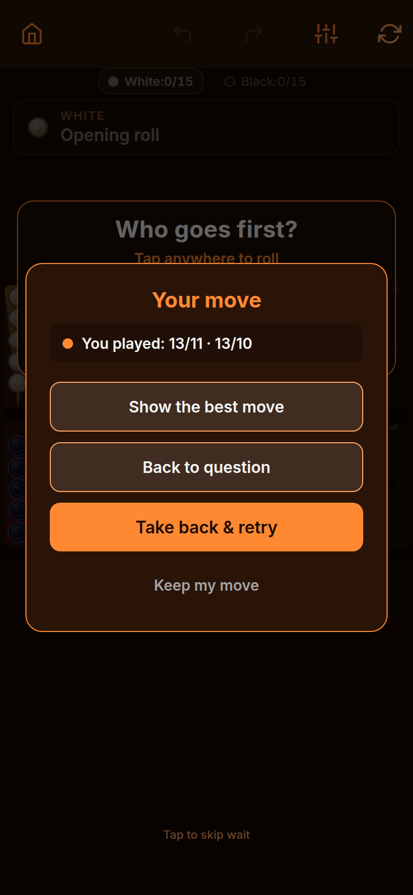
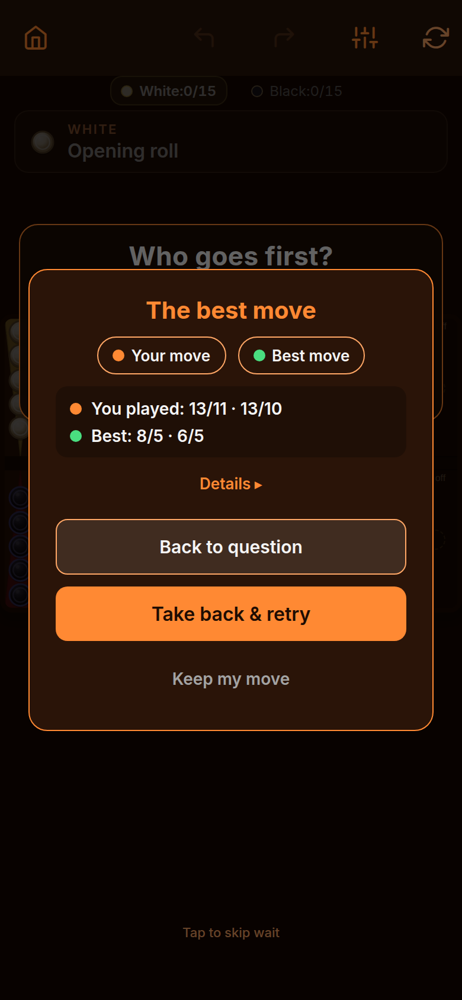

# Transition-matrix evidence — Show my move + reveal-state fixes

Captured 2026-09-24 in Chromium 390×844 (Expo web, device scale 2) against
the final code, through the real modal UI. The blunder session itself was
synthetic (loss 0.22, 5th-best of 12, player 13/11 · 13/10, best 8/5 · 6/5);
every tap was a real UI button. The temporary trigger was fully reverted
before commit — `git grep bmm-qa-modal` is clean.

## What these prove

- **02** — both arrow toggles were switched OFF, then Back → Show the best
  move: both toggles are back on and both paths visible. (This is the bug:
  stale `showMine: false` / `showEngine: false` used to survive the reveal.)
- **04** — Show my move → mine-only → Back → Show the best move: the full
  solution is restored, both arrow sets on. (Stale `revealMineOnly: true`
  used to survive.)
- **05** — after Keep with toggles off, the next session opens with default
  toggles. (Sessions never inherit stale reveal state.)
- **01** — question view: Big blunder title, GNU meter with needle in the
  red band, caption, all five buttons, no answer spoiled. Card 342×575 —
  fits the 390×844 viewport, no clipping or overflow.
- **03** — mine-only: player notation visible, best move and engine toggle
  hidden.

## Regression coverage

Three new unit tests in `src/features/game/components/guidance-modal.test.tsx`
lock the transitions: mine-only → Back → full reveal, toggles-off → Back →
full reveal, and fresh-session defaults. Full suite: 450/450 pass.

